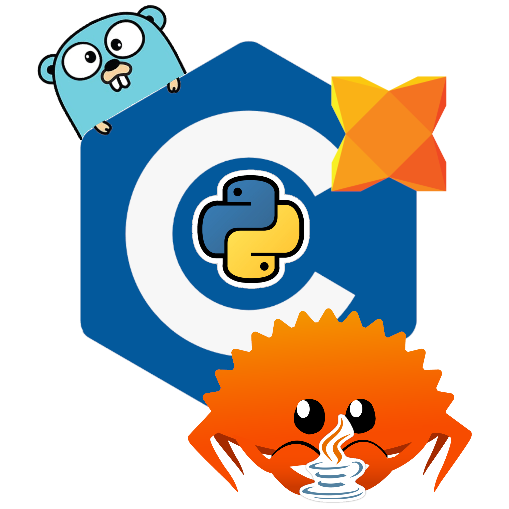

[](logo.png)
# Benchmarking Programming Languages

COMP30040 - 3rd Year Project - Benchmarking Programming Languages by Marios Yiannakou (marios.yiannakou@student.manchester.ac.uk | marios.yiannakou@hotmail.com)

Supervisor: Bijan Parsia (bijan.parsia@manchester.ac.uk)

# Discord
Join my [Discord server](https://discord.gg/9S4tqXWb) to discuss your implementations with the rest of the community and compare ideas!

# Introduction
This project tackles/investigates the [*The Computer Language Benchmarks Game (Wikipedia)*](https://en.wikipedia.org/wiki/The_Computer_Language_Benchmarks_Game). An open-source software project, whose aim is to compare the implementations of a subset of simple algorithms in a plethora of programming languages, and determine (based on predetermined metrics) which is fastest in producing a result.

Helpful links:
- [The Computer Language Benchmarks Game Website](https://benchmarksgame-team.pages.debian.net/benchmarksgame/)
- [The Computer Language Benchmarks Game Repository](https://salsa.debian.org/benchmarksgame-team/benchmarksgame)
- A [repository](https://github.com/PlummersSoftwareLLC/Primes) similar to the Computer Language Benchmarks Game that runs a prime sieve in different languages.

## Problem Addressed
The project does not tackle a *problem* per say. Based on your definition of what a problem is.

Here, the term *problem* will be used as an "obstacle in the way" of achieving the desired goal. An element introduced or discovered whilst researching the project, which has caused progress to come to a halt. The lack of active development on the source code can be considered a problem, but not to the goal that needs to be achieved.

## Possible resolution
A method of making progress in a community project perspective (e.g. resolving the "problem" described above), would be to expand upon existing algorithm test suites, improve the efficiency of existing algorithms to create a more fair comparison, or introduce new algorithms altogether.

Each of said resolutions can be done on a single or multiple programming languages. A good plan would be to focus on a single language to get a feel of how the process works, possibly open a pull-request and see how the general public reacts, before proceeding on multiple language implementations.

This does remain to be a final year dissertation project, though, so myself personally will be more focused on achieving my personal goals (described below).

# Goals
- ## Personal
The main goal I wish to achieve out of this project, is discover programming languages which are considered unconventional (whether that be in a university or industrial setting), and would otherwise not have a chance to explore. As a consequence of writing the same problem in different languages, I believe this might cause an acceleration in the learning process, as I would need to only translate code from one language to the next. An excellent method, in my opinion, to quickly learn the syntax of many languages, as the result is clear. One needs to focus on "the journey".

Another goal is to cultivate my knowledge for efficient algorithm implementation, a basic necessity for someone with the title of "Computer Scientist". Being able to write different algorithms in different languages, might help with visualisation and memorisation of said algorithms. Though the actual goal would be to eventually get to an understanding of algorithms, such as to create my own. Whether that is an extension of an existing, or a new one from scratch designed for a specific problem.

- ## Original project
The original goal for this project, as quoted from:
- the project's [wikipedia page](https://en.wikipedia.org/wiki/The_Computer_Language_Benchmarks_Game), "...comparing how a given subset of simple algorithms can be implemented in various popular programming languages."
- a ([page](https://wiki.c2.com/?GreatComputerLanguageShootout)) keeping updates regarding the project, "When I started this project, my goal was to compare all the major scripting languages..."

Any contribution to this goal is considered not only a success towards my degree project, but my personal growth and the community-kept project as well.

# Plan
This project is written with easy expandability and cross-platform compatibility in mind (a problem I found as a beginner with the original shootout and the Primes repo).

Write a suite of microtasks (known algorithms, mini programs i.e. <100 LOC) and benchmark them in many languages. The microtasks serve as a means of expanding the number of programming languages I can write a basic program in (i.e. tests that I can use programming concepts such as loops, conditionals, functions, etc). These will be timeboxed strictly as the program is known and something most people have probably come across during their career (job, studies, etc), and hence will only require basic Google searches or even one week of the languages "Getting started" tutorial to learn.

Write a mid-size program specced by myself (have chosen a [shaved down version](./markdown-parser/README.md) of a markdown parser) with the aim of being realistic as to how much I can implement in a short amount of time (about 4 weeks) and in a generous, but conservative number of languages. I'm not expecting that the markdown parser will have as many language implementations as the micro tasks, but should have at least 1 that I consider "exotic" for myself (i.e. not any languages I consider myself comfortable or familiar with).

# Requirements
## Build from source code
You will require to be in a Linux environment for the provided script to work as it runs on the `bash` shell and uses the UNIX output redirection / file manipulation commands. I personally used `Ubuntu 20.04.1` with a `5.11.0-38-generic` kernel.

For installation instructions on any of the following executables please refer to each pre-requisites install page or [INSTALLATION.md](/INSTALLATION.md).

### Pre-Requisites for the host machine
- Ubuntu 20.04 or any UNIX environment to run `bash` scripts
    | Language | Version Used |
    |----------|--------------|
    | Python (version 3.x.x) | 3.9.7 |
    | C (GCC) | (Ubuntu 9.4.0-1ubuntu1~20.04) 9.4.0 |
    | GNU make | 4.2.1 |
    | Java | (Docker container runs with JDK 11.0) but downloads `default-jdk-headless` |
    | GoLang | Version go1.17.8 linux/amd64 |
    | Rust (rustc) | 1.57.0 |
    | Haxe | 4.2.5 |

## Build using Docker
A docker image (which can be [found](https://hub.docker.com/r/mariosyian/benchmarking-programming-languages) here) has been published which contains all pre-requisite libraries, language compilers/executables, and a Linux Ubuntu environment that can run the benchmark script.

### Pre-Requisites for the host machine
- docker
    - Windows: The [Docker Desktop and WSL2](https://docs.docker.com/desktop/windows/install/) application is recommended.
    - MacOS: The [Docker Desktop](https://docs.docker.com/desktop/mac/install/) application is recommended.
    - Linux: The [Docker Engine](https://docs.docker.com/engine/install/) is recommended. The steps for each distro may differ.
        - Ubuntu: `sudo apt install docker`

# Usage
If you are using Docker and are unsure about your installation, you can run the `setup_and_run.sh` script that verifys if Docker has been installed and the Docker service is actively running on your machine.
```
$ ./setup_and_run.sh
```

## Manually
A general purpose (and hopefully easily expandable) `benchmark.sh` bash script has been written and will continue to be developed/optimised to accommodate any new languages introduced either by myself or any community member that stumbles across this project.
```
# Navigate to the root of this repository
# You may always run the script with the `--help` flag for available options
$ ./benchmark.sh
.
.
.
# View the benchmark report
$ more ./benchmarks/benchmarks
LANGUAGE  ALGORITHM        RUN  ELAPSED (s)  Avg. CPU (%)  Avg. RSS (KB)  Avg. VMS (KB)  SCORE
rust      sieve            10   28.699664    5307          112474         304986         230
go        sieve            10   20.549223    586           156977         35932663       727
java      sieve            10   20.565989    729           662307         24069962       608
c         sieve            10   20.555779    613           29454          127875         821
python    sieve            10   35.822788    6427          516759         1106586        158
haxe      sieve            10   54.184947    8247          3488081        4058379        80
python    markdown-parser  10   10.383249    102           167823         486129         3470
haxe      markdown-parser  10   20.548773    511           1368331        1804429        800

CPU:            AMD Ryzen 9 3900X
Processors:     12 Cores / 24 Threads
Memory:         ~15 GB
Average Score:  861
```

## Docker
The Docker image can be run with only the `-d` flag enabled, which runs each benchmark 100 times and displays the final averages, by running:
```
$ docker run mariosyian/benchmarking-programming-languages:2.2.2
```
or override the default behaviour by running:
```
$ docker run mariosyian/benchmarking-programming-languages:2.2.2 <override command>
e.g.
# Runs each benchmark 5 times, saves the results as a comma separated string, and prints them out on the console afterwards.
$ docker run mariosyian/benchmarking-programming-languages:2.2.2 ./benchmark.sh -r 10 -d --csv
```
or launch a shell into the Docker container (note that no Volume has been set as the Docker image already occupies ~2GB of storage so any changes you make inside the Docker container will be lost) by running:
```
$ docker run -it mariosyian/benchmarking-programming-languages:2.2.2 sh
$ ./benchmark.sh -r 5 -d

# Press Ctrl + D to exit the container image
```
# Using dependency files

Some of the languages used require some extra files to execute (i.e. Java requires an external testing suite framework as a JAR file, C requires the Unity testing framework as an external C library file). These could be downloaded manually, but since the idea of the project is that it should be easy for the average to beginner coder to pick it up and start coding. Environment setup should be of little to no concern hence, why some of the required libraries are included in the `dependencies` directory.

## Python
Python has a `requirements.txt` and `requirements_dev.txt` file which contains any dependency libraries needed. When actively developing, it's recommended to install the dependencies from `requirements_dev.txt` as they contain formatting tools used to ensure the code is written in a consistent manner.

Install the required libraries by running `pip install -r requirements_dev.txt`.

If you are using VSCode, refer to [this manual](https://dev.to/adamlombard/how-to-use-the-black-python-code-formatter-in-vscode-3lo0) on how to setup python `black` (one of python's formatting tools), to format your code each time you save.

## Java
### VSCode
In order to use the JUnit testing framework with VSCode, the following need to be added to your `settings.json`:
```
"java.project.referencedLibraries": [
    "lib/**/*.jar",
        // Absolute path to junit.jar
        "~/git/benchmarking-programming-languages/dependencies/junit/junit-4.10.jar"
],
```

## Haxe
Haxe has a few dependencies required for the auto-formatting and testing libraries. Due to the `neko` VM created by the Haxe foundation being put into a deprecation period, I've decided to download and include the two required libraries inside the `dependencies` directory found in the root of the project.

AFAIK they will still require that you successfully install and setup `haxelib` until the Haxe `neko` VM is integrated into the `haxe` executable in the future, which is something I have been unsuccessful in recreating in a docker environment.
